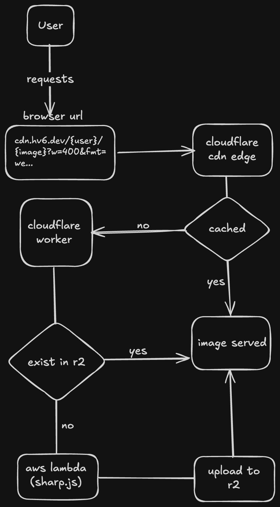
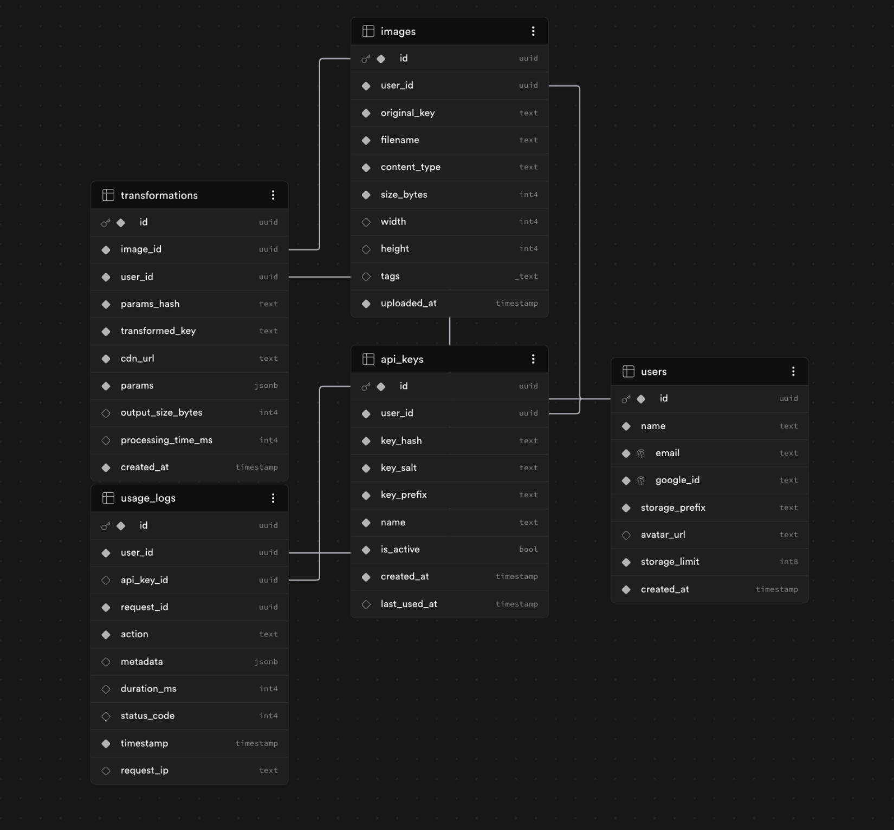

<div align="center">

**Multi-tenant Image CDN with serverless transforms and edge caching.**

Cloudinary-style URL transformations (resize, crop, format, blur, modulate) using
AWS Lambda + Sharp.js, served from Cloudflare Workers with R2-cached edge delivery.


[**Live Demo**](https://cdn.hv6.dev/906fc568-6cc1-49b1-8bc4-8795a7cba95e/757ced26-d74f-43ae-a611-1d735d3ef8fc.jpeg?w=800&h=600&fmt=webp&q=85&crop=center&blur=2&sharpen=true&grayscale=true&rotate=90&flip=true&flop=true&brightness=1.2&saturation=1.5) ·
[**Console**](https://console.cdn.hv6.dev) ·
[**API Health**](https://image-pipeline-v2-express.hv6.dev/api/health)

</div>

---

## Architecture





Three independent layers, each deployed to its own platform:

| Layer | Runtime | Hosted on | Purpose |
|---|---|---|---|
| **Worker** (edge) | Cloudflare Workers | Cloudflare | Public-facing CDN; checks R2 cache, falls through to API on miss |
| **API** (origin) | Node.js / Express | VPS | Auth, image metadata, R2 presigned uploads, transform orchestration |
| **Lambda** (compute) | Node 20 / Sharp.js | AWS | Heavy image processing (resize, format, effects), invoked only on cache miss |

Plus three managed services: **Cloudflare R2** for storage, **Neon Postgres** for metadata, **Google OAuth** for identity.

---

## Features

- **Multi-tenant isolation** — every layer (DB, storage, cache keys, API auth) is scoped per user.
- **13 URL transform params** — `w`, `h`, `fmt` (webp/avif/png/jpg), `q`, `crop`, `blur`, `sharpen`, `grayscale`, `rotate`, `flip`, `flop`, `brightness`, `saturation`.
- **Three-layer caching** — Cloudflare edge → R2 origin → Postgres dedup index. Repeat transforms served in single-digit ms from R2 binding.
- **Direct-to-R2 uploads** — clients PUT to a presigned URL; the API never proxies image bytes.
- **Two auth modes** — Google OAuth sessions for the console, hashed API keys (`hv_…`) for programmatic access. `flexAuth` middleware accepts either.
- **Rate limiting** — 100 req/min per API key, enforced via sliding-window count on `usage_logs`.
- **Three independent CI/CD pipelines** — every `git push` deploys Lambda (SAM + GitHub Actions), Express (auto-deploy), and Worker (Cloudflare Builds) without manual steps.
- **Public Inline Url Tranforms** - anyone can apply transformations to an image with the public cdn url link.
---

## Quick start

### Transform an image via URL

```bash
# Basic resize + format
curl -o thumb.webp \
  "https://cdn.hv6.dev/<userId>/<imageId>.jpeg?w=400&fmt=webp"

# Square crop + grayscale
curl -o square.png \
  "https://cdn.hv6.dev/<userId>/<imageId>.jpeg?w=400&h=400&crop=center&grayscale=true&fmt=png"

# Blur + rotate + quality
curl -o art.webp \
  "https://cdn.hv6.dev/<userId>/<imageId>.jpeg?w=600&fmt=webp&q=85&blur=3&rotate=90"
```

### Transform via API

```bash
curl -X POST https://image-pipeline-v2.onrender.com/api/v1/transform \
  -H "Authorization: Bearer hv_..." \
  -H "Content-Type: application/json" \
  -d '{
    "user_id": "<userId>",
    "image_id": "<imageId>",
    "w": 400,
    "fmt": "webp",
    "q": 85
  }'
```

Returns:
```json
{
  "cdn_url": "https://cdn.hv6.dev/<userId>/<imageId>.webp?w=400&fmt=webp&q=85",
  "cached": false,
  "processing_time_ms": 247
}
```

---

## Tech stack

| Layer | Stack |
|---|---|
| **Language** | TypeScript (Express, Worker), JavaScript (Lambda) |
| **API** | Express 5, Helmet, Passport, cookie-session, Zod |
| **Database** | Neon Postgres + Drizzle ORM |
| **Storage** | Cloudflare R2 (S3-compatible) with presigned uploads |
| **Edge** | Cloudflare Workers with native R2 bindings |
| **Compute** | AWS Lambda (Node 20, 1024 MB) + Sharp.js 0.33 |
| **Auth** | Google OAuth 2.0 (sessions) + SHA-256-hashed API keys (Bearer) |
| **Infra-as-code** | AWS SAM (esbuild build), `wrangler.toml`, `template.yaml` |
| **CI/CD** | GitHub Actions (Lambda), auto-deploy (Express), Cloudflare Workers Builds (Worker) |

---

## API reference

All `/api/v1/*` routes require either a session cookie (OAuth) or `Authorization: Bearer hv_…` header. The `flexAuth` middleware auto-detects which.

| Method | Path | Auth | Description |
|---|---|---|---|
| `GET` | `/api/health` | none | Status, uptime, DB latency |
| `GET` | `/api/auth/google` | none | OAuth start (top-level navigation) |
| `GET` | `/api/auth/me` | session | Current user |
| `POST` | `/api/auth/logout` | session | Clear session |
| `POST` | `/api/auth/guest` | none | Sandbox login (rate-limited 5/min/IP) |
| `POST` | `/api/v1/keys` | session | Create API key (raw key returned once) |
| `GET` | `/api/v1/keys` | session | List user's keys |
| `DELETE` | `/api/v1/keys/:id` | session | Revoke key |
| `POST` | `/api/v1/upload` | flexAuth | Get presigned R2 upload URL |
| `POST` | `/api/v1/upload/url` | flexAuth | Server-side ingest from URL |
| `GET` | `/api/v1/images` | flexAuth | Paginated image list (search, format, sort) |
| `GET` | `/api/v1/images/:id` | flexAuth | Single image + transforms |
| `PATCH` | `/api/v1/images/:id` | flexAuth | Update filename/tags |
| `DELETE` | `/api/v1/images/:id` | flexAuth | Delete image + cached transforms from R2 |
| `POST` | `/api/v1/transform` | flexAuth | Generate transform (requires `user_id`, `image_id`) |
| `POST` | `/api/v1/images/:id/transforms` | flexAuth | List previous transforms |
| `GET` | `/api/v1/usage` | flexAuth | Per-user storage, transform count, today's API calls |

Rate limit: **100 req/min per API key**, surfaced via `X-RateLimit-*` headers.

---

## Project structure

```
.
├── src/                          Express API
│   ├── config/                   env, db, R2 clients
│   ├── db/schema.ts              5 tables: users, apiKeys, images, transformations, usage_logs
│   ├── middleware/               auth, flexAuth, rateLimiter, errorHandler, requestId, logger
│   ├── routes/                   auth, keys, upload, images, transform, usage, health
│   ├── services/                 image, key, transform, upload, usage business logic
│   ├── lib/                      paramHash, paramParser, lambda invoker
│   └── index.ts                  app entry + middleware wiring
├── lambda/                       AWS Lambda (Node 20)
│   ├── handler.js                Sharp.js pipeline (resize, format, effects)
│   ├── package.json              
│   └── package-lock.json
├── worker/                       Cloudflare Worker
│   ├── index.ts                  Edge handler: R2 cache → API origin fallback
│   └── wrangler.toml
├── drizzle/                      Generated SQL migrations
├── .github/workflows/            Lambda deploy via SAM
├── template.yaml                 AWS SAM template (esbuild build method)
├── samconfig.toml                Saved SAM deploy params
├── architecture.png              Architecture diagram
└── README.md
```

---

## Local development

### Prerequisites
- Node 20+
- A Neon Postgres database (free tier works)
- A Cloudflare account with an R2 bucket
- Google OAuth client (Cloud Console → APIs & Services → Credentials)
- AWS account with Lambda + IAM access (for full deploy; not needed for API-only dev)

### Setup

```bash
git clone https://github.com/himanshuverma8/image-pipeline-v2.git
cd image-pipeline-v2
npm install

cp .env.example .env
# Fill in: DATABASE_URL, GOOGLE_CLIENT_ID/SECRET, AUTH_SECRET,
#          R2_* credentials, AWS_* credentials, CALLBACK_URL

npm run db:generate   # generate migration from schema
npm run db:migrate    # apply to Neon

npm run dev           # API on :3000
```

Verify:
```bash
curl http://localhost:3000/api/health
# {"status":"healthy","uptime":3,"db":{"latency_ms":42},"timestamp":"..."}
```

### Lambda dev

```bash
cd lambda
npm install --include=optional
cd ..
sam build && sam deploy --guided   # first time only; saves to samconfig.toml
```

Subsequent deploys happen automatically via GitHub Actions on changes to `lambda/**` or `template.yaml`.

### Worker dev

```bash
cd worker
npx wrangler dev      # local Worker on :8787
npx wrangler deploy   # ship to Cloudflare
```

---

## Deployment

| Service | How |
|---|---|
| **Express API** | auto-deploys on `git push` to `main`. Build: `npm install && npm run build`. Start: `node dist/index.js`. |
| **Lambda** | GitHub Actions (`.github/workflows/deploy-lambda.yaml`) runs `sam build && sam deploy` on changes to `lambda/**` or `template.yaml`. |
| **Worker** | Cloudflare Workers Builds redeploys on every push. |
| **Frontend console** | Vercel auto-deploy from `cdn-console` repo (separate repo). Custom domain: `console.cdn.hv6.dev`. |

### Required secrets

| Where | Variable |
|---|---|
| env vars (backend) | `DATABASE_URL`, `GOOGLE_CLIENT_ID`, `GOOGLE_CLIENT_SECRET`, `AUTH_SECRET`, `CALLBACK_URL`, `R2_*`, `AWS_*`, `LAMBDA_FUNCTION_NAME`, `R2_PUBLIC_URL`, `NODE_ENV=production` |
| GitHub Actions | `AWS_ACCESS_KEY_ID`, `AWS_SECRET_ACCESS_KEY`, `R2_ENDPOINT`, `R2_ACCESS_KEY_ID`, `R2_SECRET_ACCESS_KEY`, `R2_BUCKET_NAME` |
| Cloudflare Worker | `WORKER_API_KEY` (a service-role `hv_…` key) as a runtime secret |

---

## Design decisions

A few non-obvious choices and why they matter:

- **Cloudflare R2 over S3** — zero egress fees forever. Critical when you're serving image bytes at the edge.
- **Cloudflare Worker over CloudFront** — native R2 binding reads in single-digit ms vs ~50ms via public R2 endpoint. Also lets the Worker call the origin API on cache miss without leaving Cloudflare's network.
- **Direct-to-R2 presigned upload** — clients PUT to R2 directly instead of streaming bytes through the API. Saves Express memory + server bandwidth on every upload.
- **SHA-256 content-addressed cache keys** — the same `paramsHash` is computed identically on edge and origin, so the Worker can `R2.get(key)` deterministically without coordinating with the API.
- **flexAuth middleware** — same routes accept either session or Bearer auth. Console uses sessions (better UX, no key paste); programmatic clients (Worker, CI) use Bearer. One implementation, two contexts.
- **AWS SAM with esbuild** — TypeScript Lambda compiles to JS at build time without a separate `tsc` step. Sharp's Linux-x64 binary pinned via `supportedArchitectures` in `lambda/package.json` so macOS dev builds don't ship the wrong native binary.


---

<!-- https://roadmap.sh/projects/image-processing-service -->